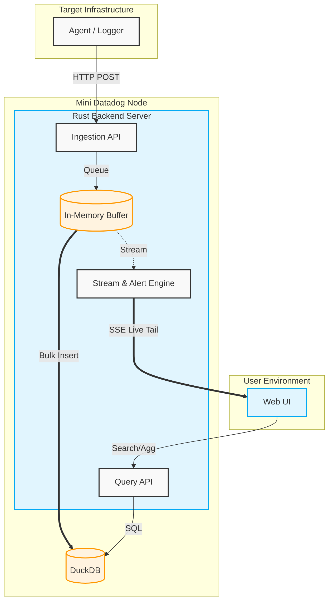

# Mini Datadog

## Overview
Mini Datadog は、中小規模のインフラやアプリケーションを運用するエンジニア向けの、軽量かつ高速なシステム監視・ログ分析プラットフォームです。高価な SaaS に依存することなく、セルフホストでシンプルに導入できることを目指しています。バックエンドに Rust、データストアに組み込みの DuckDB、フロントエンドに Next.js を採用し、単一バイナリで動作します。

## Prerequisites
- Linux / macOS 環境
- 推奨要件: 2 CPU Core, 4GB RAM 以上のリソース（テスト環境ではそれ以下でも動作可能）

## Features
- **単一バイナリ (Single Binary):** Rust バックエンドにフロントエンドのアセットを内包しており、インストールと運用が極めて容易です。
- **高速データ受信:** インメモリバッファを活用し、毎秒 5,000 件以上のログ・メトリクス受信を低レイテンシで処理します。
- **リアルタイム Live Tail:** Server-Sent Events (SSE) を活用し、発生したログをミリ秒単位の遅延でブラウザへストリーミングします。
- **軽量データストア:** DuckDB を組み込みデータベースとして採用し、外部データベースの構築を不要としています。

## Quick Start
```bash
# 1. バイナリのダウンロードまたはビルド（ビルドの場合）
cargo build --release

# 2. サーバーの起動
./target/release/mini_datadog serve

# 3. Web UI にアクセス
# ブラウザで http://localhost:3000 にアクセスします。
```

## Architecture Overview
以下の図は、Mini Datadog の全体像を示しています。



## References
- [User Guide](docs/setup/user_guide.md)
- [API Reference](docs/api/api_reference.md)
- [Internal Design](docs/architecture/internal_design.md)