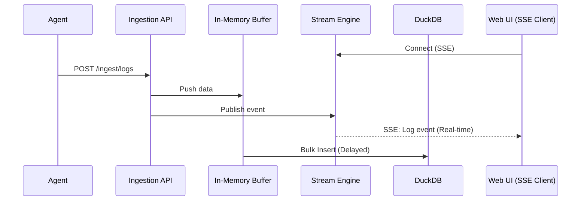

# 内部設計書 (Internal Design Details)

## Overview
本ドキュメントは、Mini Datadog における中核的な内部設計（DuckDB の活用、SSE によるデータ配信、データ保持ロジック等）について解説します。対象読者は、アーキテクチャの変更や機能追加を行う開発者です。

## Prerequisites
- Rust バックエンドの非同期処理（Tokio）に関する基礎知識。
- DuckDB の基本概念の理解。

## 1. データベース設計と DuckDB の活用
Mini Datadog は、組み込み型の分析用データベースである **DuckDB** をデータストアとして採用しています。

### 1.1 バルクインサート (Bulk Insert)
大量の細かい I/O を避けるため、受信したデータは一旦 `In-Memory Buffer`（MPSC チャネル）に蓄積されます。
バックグラウンドのワーカータスクが、以下の条件を満たした際に DuckDB へのバルクインサートを実行します。
- バッファ内のデータが一定件数（例: 1,000 件）に達したとき。
- 一定時間（例: 1 秒）が経過したとき。

### 1.2 ログテーブルスキーマ
```sql
CREATE TABLE logs (
    timestamp TIMESTAMP,
    received_at TIMESTAMP,
    level VARCHAR,
    service VARCHAR,
    message TEXT,
    tags JSON,
    attributes JSON
);
```

## 2. SSE を用いた Live Tail 配信 (SSE Delivery)
Live Tail 機能は、DuckDB への書き込みを待たずに、インメモリのストリームから直接クライアント（ブラウザ）へデータを配信します。

### 2.1 ストリーム配信のメカニズム
1. `Ingestion API` がデータを受け取ると、バッファにプッシュすると同時に `Stream Engine` へもイベントを発行します。
2. `Stream Engine` は、接続中のクライアントに対し Server-Sent Events (SSE) プロトコルを用いてイベントをブロードキャストします。



## 3. データ保持とクリーンアップロジック (Data Retention Strategy)
セルフホスト環境におけるディスク枯渇を防ぐため、自動的なデータクリーンアップジョブを実装しています。

- **保持期間 (Retention Period):** デフォルトで 30 日間。環境変数で変更可能。
- **実行間隔:** バックグラウンドタスクとして 1 時間ごとに起動。
- **削除処理:** `DELETE FROM logs WHERE timestamp < <threshold>` クエリを発行し、不要なデータを物理的に削除します。

## References
- [API Reference](../api/api_reference.md)